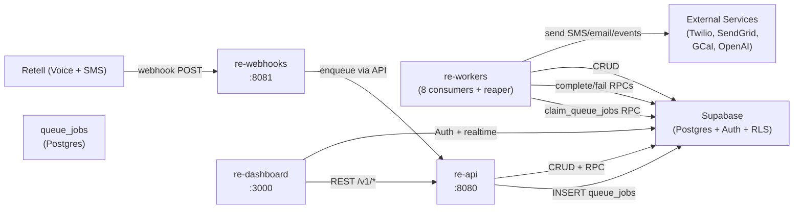
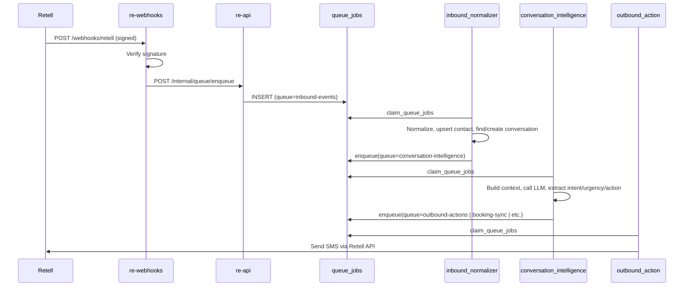
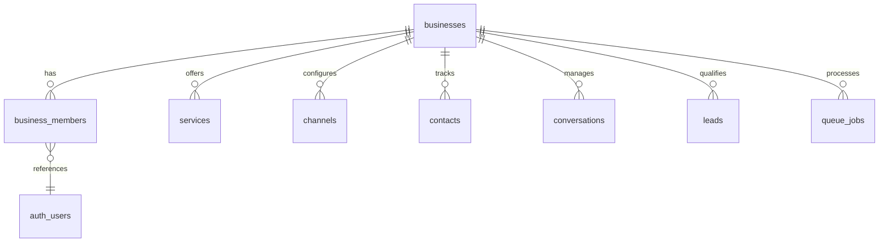
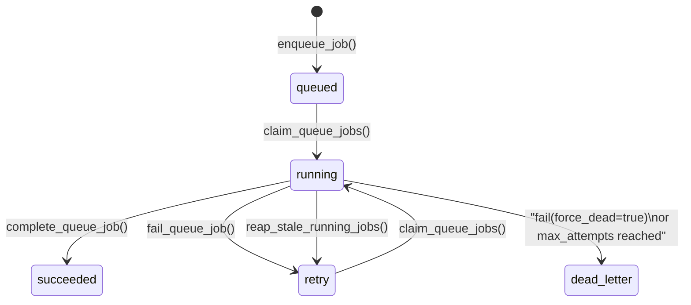

# Architecture

Revenue Edge is a multi-tenant SMB revenue-capture agent built on four Python/Node services backed by a single hosted Supabase project. This document covers system design, data flow, and key architectural decisions.

## Design Philosophy

- **Postgres-only queue**: No Redis, RabbitMQ, or Temporal. `queue_jobs` is a Postgres table with `claim_queue_jobs` / `complete_queue_job` / `fail_queue_job` RPCs. This eliminates operational overhead while supporting retry, dead-letter, priority, and idempotency.
- **Multi-tenant via RLS**: Every tenant table has a `business_id` column. Row-Level Security policies use `auth.uid()` joined through `business_members` to enforce isolation at the database level.
- **Copilot-first**: The agent handles routine demand capture autonomously but escalates to a human operator when confidence is low, the topic is sensitive, or business rules require it.
- **Trace propagation**: A `trace_id` flows from the initial webhook through every queued job and outbound action, enabling end-to-end debugging via structured logs.

## System Topology



### Production Routing (Caddy)

In production, a Caddy reverse proxy handles TLS and routes traffic:

| Path | Backend |
|------|---------|
| `/webhooks/*` | `re-webhooks:8081` |
| `/v1/*` | `re-api:8080` |
| `/health` | `re-api:8080` |
| `/internal/*` | Blocked (403) |
| `/*` (default) | `re-dashboard:3000` |

## Data Flow

### Inbound Event Processing



### Worker Pipeline

Each inbound event flows through a chain of workers:

1. **inbound_normalizer** -- Normalizes the raw webhook payload, upserts the contact, finds or creates a conversation, inserts the message, and enqueues for intelligence.
2. **conversation_intelligence** -- Builds conversation context (messages + business rules + knowledge), calls the LLM for classification, and dispatches to the appropriate next queue based on `recommended_next_action`.
3. **outbound_action** -- Sends SMS/email replies, quote notifications, photo request links, or slot offers via the configured provider.
4. **handoff** -- Creates a `human_handoff` task and notifies the operator when the agent cannot handle a request.
5. **followup_scheduler** -- Manages drip sequences (quote follow-ups, no-response nudges) by enqueuing delayed outbound jobs.
6. **knowledge_ingestion** -- Embeds knowledge items via OpenAI, scrapes websites, and fetches Google Docs for the knowledge base.
7. **quote_drafting** -- Uses the LLM to draft quotes from collected intake fields, creates the quote record, and routes to auto-send or human review.
8. **booking** -- Checks Google Calendar availability, creates calendar events, manages reschedule/cancel sync, and falls back to callback tasks when calendar is unavailable.

A **reaper** coroutine runs alongside the workers and resets jobs stuck in `running` state for longer than 10 minutes (handles worker crashes).

## Multi-Tenancy



- **Isolation**: Every tenant-scoped table includes `business_id` with a foreign key to `businesses`. RLS policies grant access only when the requesting user is a member of that business (via `is_business_member()` helper).
- **Roles**: `owner > admin > operator > analyst > readonly`, enforced by `has_business_role()` with numeric weight comparison.
- **Service key bypass**: Workers and inter-service calls use the Supabase service role key, which bypasses RLS. The `INTERNAL_SERVICE_KEY` authenticates re-webhooks -> re-api requests.

## Queue System

### Job Lifecycle



### Key RPCs

| RPC | Purpose |
|-----|---------|
| `enqueue_job` | Idempotent insert with priority, delay, and max_attempts |
| `claim_queue_jobs` | Atomic lock-and-return of N jobs per queue per worker |
| `complete_queue_job` | Mark succeeded, store result, release lock |
| `fail_queue_job` | Retry with backoff or force dead-letter on `PermanentError` |
| `reap_stale_running_jobs` | Reset crashed jobs (running > 10 min) to retry/dead_letter |

### Backoff Strategy

Retries use exponential backoff with decorrelated jitter: `uniform(base, min(cap, base * 2^(attempt-1)))` where base=30s and cap=3600s.

### Idempotency

Every job carries an `idempotency_key` (unique partial index). Re-enqueuing the same key is a no-op, preventing duplicate processing from at-least-once delivery.

## Authentication

### Dashboard (External Users)

- Supabase Auth with email/password (login/signup pages)
- Next.js middleware refreshes session cookies on every request
- API calls include `Authorization: Bearer <supabase_jwt>` and `x-business-id` header
- The API validates the JWT, extracts `auth.uid()`, and confirms business membership

### Inter-Service (Internal)

- `re-webhooks -> re-api`: `X-Internal-Key` header checked against `INTERNAL_SERVICE_KEY` env var
- `re-workers -> re-api`: Same internal key for queue enqueue and other internal endpoints
- Workers use the Supabase service role key directly for database operations (bypasses RLS)

## External Integrations

| Service | Used By | Purpose |
|---------|---------|---------|
| **Retell AI** | webhooks, outbound_action | Voice call handling, SMS send/receive |
| **Twilio** | outbound_action (fallback) | SMS fallback when Retell unavailable, STOP/HELP compliance |
| **OpenAI** | conversation_intelligence, quote_drafting, knowledge_ingestion | LLM classification/drafting, text embeddings |
| **Google Calendar** | booking worker | FreeBusy availability, event create/update/cancel |
| **SendGrid** | outbound_action | Transactional email delivery |

All external calls include:
- Timeouts (15-30s depending on service)
- `httpx.RequestError` handling for network failures
- Structured error logging with trace context
- Graceful fallbacks (e.g., Retell SMS -> Twilio fallback, LLM -> heuristic fallback, embedding failure -> lexical-only search)

## Observability

- **Structured JSON logging**: All services emit JSON logs with `trace_id`, `job_id`, `business_id`, `queue`, and timing fields.
- **Sentry**: Optional error monitoring via `SENTRY_DSN` (initialized in both API and workers).
- **Health checks**: `/health` (liveness) and `/ready` (Supabase reachability) endpoints on the API; Docker Compose health checks on all services.
- **Metrics**: Daily `metric_snapshots` rollup tracks missed calls, recovered leads, quotes, bookings, response times, reactivation performance, and attributed revenue.

## Directory Structure

```
RevenueEdge/
├── apps/
│   ├── api/              # re-api: FastAPI REST gateway + scheduler
│   ├── webhooks/         # re-webhooks: Retell webhook receiver
│   ├── workers/          # re-workers: queue consumers
│   └── dashboard/        # re-dashboard: Next.js operator UI
├── supabase/
│   ├── schema.sql        # Full bootstrap schema
│   ├── migrations/       # Incremental patches (0002-0004)
│   └── seed_mvp_defaults.sql
├── scripts/              # bootstrap, run scripts, smoke tests, seed
├── docs/                 # Guides and specifications
├── workflows/            # Queue contracts (YAML + prose)
├── infra/caddy/          # Production Caddyfile
├── .github/workflows/    # CI pipeline
├── docker-compose.yml    # Dev environment
└── docker-compose.prod.yml  # Production environment
```
