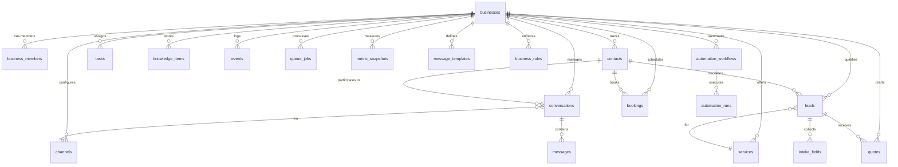

# Database Guide

Revenue Edge uses a single hosted Supabase project with PostgreSQL 17, four extensions, and Row-Level Security for multi-tenant isolation.

## Extensions

| Extension | Purpose |
|-----------|---------|
| `pgcrypto` | `gen_random_uuid()` for primary keys |
| `citext` | Case-insensitive text for email and business slug |
| `vector` | pgvector for 1536-dim knowledge embeddings |
| `pg_trgm` | Trigram similarity for fuzzy text search on knowledge items |

## Entity Relationship Diagram



## Core Tables

### Multi-Tenancy

| Table | Purpose | Key Columns |
|-------|---------|-------------|
| `businesses` | Tenant root; stores name, vertical, timezone, hours, escalation rules, settings (incl. Google Calendar tokens) | `id`, `slug`, `vertical`, `status`, `settings` (jsonb) |
| `business_members` | Maps users to businesses with roles | `business_id`, `user_id`, `role` (owner/admin/operator/analyst/readonly) |

### Communication

| Table | Purpose | Key Columns |
|-------|---------|-------------|
| `channels` | Inbound/outbound channel config (phone, SMS, email, etc.) | `business_id`, `channel_type`, `provider`, `external_id`, `status`, `config` |
| `contacts` | Customer records with E.164 phone and citext email | `business_id`, `phone_e164`, `email`, `source_channel`, `tags`, `metadata` |
| `conversations` | Threaded interaction sessions | `business_id`, `contact_id`, `channel_type`, `status`, `current_intent`, `urgency`, `ai_confidence`, `summary` |
| `messages` | Individual messages within conversations | `conversation_id`, `direction`, `sender_type`, `body`, `attachments`, `raw_payload`, `idempotency_key` |
| `message_templates` | SMS/email templates with Liquid-ish variables | `business_id`, `name`, `channel_type`, `intent`, `body_template` |

### Pipeline

| Table | Purpose | Key Columns |
|-------|---------|-------------|
| `leads` | Qualified prospects with stage tracking | `business_id`, `contact_id`, `service_id`, `stage` (new -> won/lost), `urgency`, `value_band`, `fit_score` |
| `intake_fields` | Collected data points per lead | `lead_id`, `field_name`, `field_value`, `confidence`, `source_message_id` |
| `quotes` | Price estimates with approval workflow | `lead_id`, `status` (drafting -> sent -> accepted), `amount_low`, `amount_high`, `draft_text` |
| `bookings` | Scheduled appointments with calendar sync | `lead_id`, `contact_id`, `status` (requested -> confirmed -> completed), `scheduled_start`, `external_calendar_event_id` |
| `tasks` | Operator action items | `business_id`, `type` (human_handoff/callback/quote_review/etc.), `status`, `priority`, `source_table`, `source_id` |

### Knowledge

| Table | Purpose | Key Columns |
|-------|---------|-------------|
| `knowledge_sources` | External content sources (URLs, docs) | `business_id`, `source_type`, `uri`, `ingestion_status` |
| `knowledge_items` | Individual FAQ/policy/product entries with embeddings | `business_id`, `type`, `title`, `content`, `embedding` (vector 1536), `search_tsv` (generated tsvector), `active`, `approved` |

### Queue System

| Table | Purpose | Key Columns |
|-------|---------|-------------|
| `queue_jobs` | Async job queue (replaces Redis/RabbitMQ) | `queue_name`, `status`, `priority`, `payload`, `attempts`, `max_attempts`, `idempotency_key`, `locked_by`, `locked_at` |
| `events` | Immutable event log for audit and metrics | `business_id`, `event_type`, `aggregate_type`, `aggregate_id`, `payload`, `idempotency_key` |

### Analytics

| Table | Purpose | Key Columns |
|-------|---------|-------------|
| `metric_snapshots` | Daily aggregated metrics per business | `business_id`, `metric_date`, `missed_calls`, `recovered_leads`, `quotes_sent`, `bookings`, `wins`, `attributed_revenue`, `payload` (jsonb with extended metrics) |
| `audit_log` | User/system action audit trail | `business_id`, `actor_user_id`, `action`, `target_table`, `target_id` |

### Automation

| Table | Purpose | Key Columns |
|-------|---------|-------------|
| `automation_workflows` | Workflow definitions (trigger -> actions) | `business_id`, `key`, `trigger_event_type`, `definition` (jsonb), `status` |
| `automation_runs` | Individual workflow execution records | `workflow_id`, `conversation_id`, `status`, `input_payload`, `output_payload` |
| `action_runs` | Idempotent action execution tracking | `action_type`, `status`, `idempotency_key`, `payload`, `result` |

### Other

| Table | Purpose | Key Columns |
|-------|---------|-------------|
| `services` | Business service catalog with pricing | `business_id`, `name`, `base_price_low`, `base_price_high`, `required_intake_fields` |
| `business_rules` | Configurable rules (escalation, autopilot limits) | `business_id`, `rule_type`, `conditions`, `actions`, `priority` |
| `upload_tokens` | One-time customer upload links for photo requests | `business_id`, `conversation_id`, `purpose`, `expires_at`, `used` |

## RPC Functions

### Queue Operations

| Function | Parameters | Returns | Description |
|----------|-----------|---------|-------------|
| `enqueue_job` | queue_name, payload, business_id, available_at, priority, idempotency_key, max_attempts | uuid | Idempotent job insert |
| `claim_queue_jobs` | queue_name, worker_id, limit, lock_timeout | setof queue_jobs | Atomic lock-and-return of available jobs |
| `complete_queue_job` | job_id, result | void | Mark job succeeded |
| `fail_queue_job` | job_id, error, retry_after, force_dead | void | Retry or dead-letter a job |
| `reap_stale_running_jobs` | stale_threshold (default 10 min) | integer | Reset crashed running jobs; returns count |

### Events

| Function | Parameters | Returns | Description |
|----------|-----------|---------|-------------|
| `enqueue_event` | event_type, payload, business_id, aggregate_type, aggregate_id, idempotency_key, occurred_at | uuid | Idempotent event insert |

### Knowledge

| Function | Parameters | Returns | Description |
|----------|-----------|---------|-------------|
| `match_knowledge` | business_id, embedding, match_count, categories | table (id, title, content, type, metadata, similarity) | Cosine similarity search on knowledge embeddings |

### Conversations

| Function | Parameters | Returns | Description |
|----------|-----------|---------|-------------|
| `merge_conversation_metadata` | conversation_id, patch (jsonb) | void | Atomic metadata merge using `||` operator |

### Business Setup

| Function | Parameters | Returns | Description |
|----------|-----------|---------|-------------|
| `create_business_with_owner` | name, slug, vertical, timezone | uuid | Create business and add caller as owner |
| `seed_revenue_edge_mvp_defaults` | business_id | void | Insert default templates, rules, and workflows |

### Helpers

| Function | Purpose |
|----------|---------|
| `is_business_member(business_id)` | Check if current user belongs to business (RLS helper) |
| `has_business_role(business_id, minimum_role)` | Check if user has at least the specified role |
| `business_role_weight(role)` | Map role to numeric weight for comparison |
| `set_updated_at()` | Trigger: set `updated_at = now()` on row updates |
| `touch_conversation_from_message()` | Trigger: update conversation `last_message_at` on new message |

## Row-Level Security

RLS is enabled on all tenant-scoped tables. Policies follow a consistent pattern:

- **`tenant_select`** -- Users can read rows where they are a business member
- **`tenant_insert_member`** -- Members can insert rows for their business
- **`tenant_update_member`** -- Members can update rows for their business
- **`tenant_delete_admin`** -- Only admins and above can delete

The `businesses` and `business_members` tables have custom policies for owner-level operations. The service role key (used by workers) bypasses RLS entirely.

## Key Indexes

- **Queue claim**: `(queue_name, status, available_at, priority, created_at)` WHERE status IN ('queued', 'retry') -- enables fast job claiming
- **Knowledge search**: HNSW index on `embedding` with `vector_cosine_ops` + GIN on `search_tsv` -- powers hybrid semantic + lexical retrieval
- **Contact uniqueness**: Partial unique indexes on `(business_id, phone_e164)` and `(business_id, email)` -- prevent duplicate contacts
- **Message dedup**: Partial unique indexes on `external_message_id` and `idempotency_key` -- prevent duplicate message processing
- **Event dedup**: Partial unique index on `idempotency_key` -- prevent duplicate events

## Migration Strategy

### Bootstrap

`supabase/schema.sql` is the full schema file. Apply it to a fresh Supabase project:

```bash
psql "$SUPABASE_DB_URL" -f supabase/schema.sql
```

### Incremental Migrations

`supabase/migrations/` contains numbered patches applied after the bootstrap:

| Migration | Description |
|-----------|-------------|
| `0002_match_knowledge_rpc.sql` | pgvector similarity search RPC |
| `0003_upload_tokens.sql` | Upload token table + photos storage bucket |
| `0004_hardening.sql` | force_dead on fail_queue_job, stale job reaper, atomic metadata merge |

Apply in numeric order:

```bash
for f in supabase/migrations/0*.sql; do
  psql "$SUPABASE_DB_URL" -f "$f"
done
```

### Adding New Migrations

1. Create `supabase/migrations/NNNN_description.sql` (next sequential number)
2. Use `CREATE OR REPLACE` for functions, `IF NOT EXISTS` for tables/indexes
3. Apply to the live database and commit the migration file
4. Consider whether the change should also be reflected in `schema.sql` for fresh bootstraps
